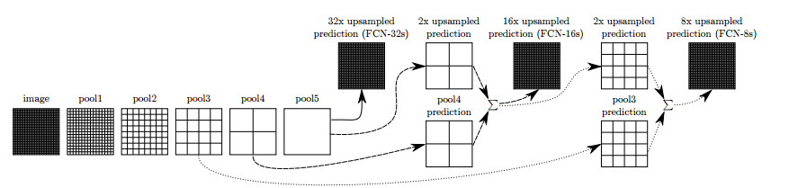
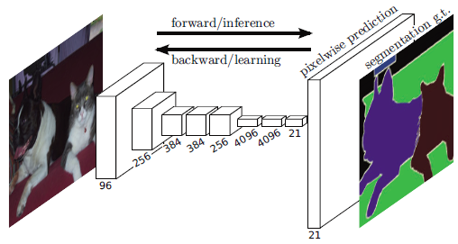
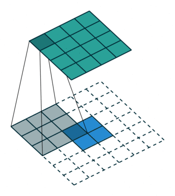
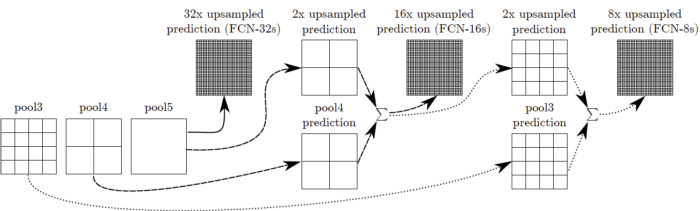

# Fully Convolutional Network

**Image Classification**: Classify the object (Recognize the object class) within an image.

**Object Detection**: Classify and detect the object(s) within an image with bounding box(es) bounded the object(s). That means we also need to know the class, position and size of each object.

**Semantic Segmentation**: Classify the object class for each pixel within an image. That means there is a label for each pixel.

## From Image Classification to Semantic Segmentation

In classification, conventionally, an input image is downsized and goes through the convolution layers and fully connected (FC) layers, and output one predicted label for the input image, as follows:

## Upsampling Via Deconvolution

Convolution is a process getting the output size smaller. Thus, the name, deconvolution, is coming from when we want to have upsampling to get the output size larger. (But the name, deconvolution, is misinterpreted as reverse process of convolution, but it is not.) And it is also called, up convolution, and transposed convolution. And it is also called fractional stride convolution when fractional stride is used.

## Fusing the Output

After going through conv7 as below, the output size is small, then 32× upsampling is done to make the output have the same size of input image. But it also makes the output label map rough. And it is called FCN-32s:

