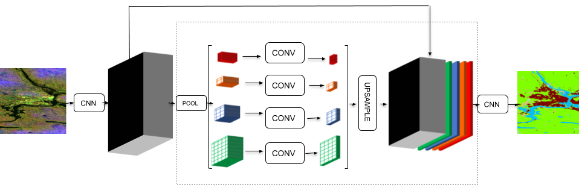
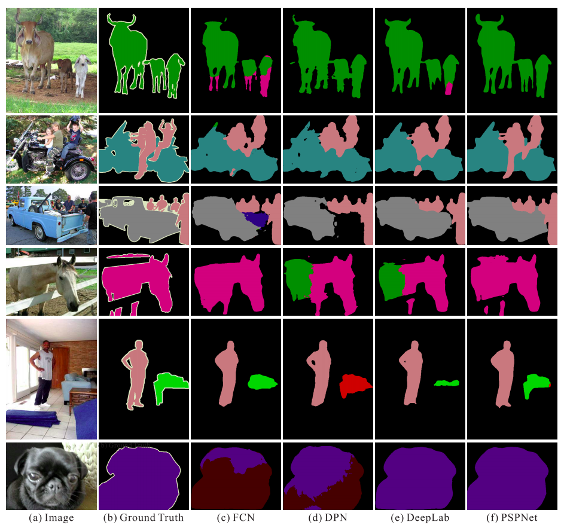

# Pyramid Scene Parsing Network



## Performance


| Method | road | swalk | build. | wall | fence | pole | tlight | sign | veg. | terrain | sky  | person | rider | car  | truck | bus  | train | mbike | bike | mIoU |
| ------ | ---- | ----- | ------ | ---- | ----- | ---- | ------ | ---- | ---- | ------- | ---- | ------ | ----- | ---- | ----- | ---- | ----- | ----- | ---- | ---- |
| PSPNet | 98.6 | 86.6  | 93.2   | 58.1 | 63.0  | 64.5 | 75.2   | 79.2 | 93.4 | 72.1    | 95.1 | 86.3   | 71.4  | 96.0 | 73.5  | 90.4 | 80.3  | 69.9  | 76.9 | 80.2 |



## Input Image

Input image of any shape usually dimensions greater than (256, 256) feed to the network.

## Feature Map

Takes input image and constructs feature maps for image. Feature maps are extracted by feeding image using transfer learning or scratch network with dilated convolutions. As large size kernels extracts more useful information than small size kernel but computation cost is higher, dilated convolutions gathers large size area information with small size kernel for higher **dilation_rates** to **keep dimensions** same as **input Image**.Generally **residual blocks** with **dilations** are used to construct feature maps.No.of feature maps **N** is a hyperparameter and needs to be tuned for good result.

## Pyramid Pooling Module

An Image contains objects of sizes ranging from small area to large area in different regions.Fully Convolution Network(FCN),U-Net and other networks constructs feature maps by upsampling and doing segmentation at different levels for segmentation of all objects in all regions.But in PSPNet to correctly segment all size objects, feature maps are pooled average pooled at different pool size.

Sub-region average pooling is done at different scales like **Global Average Pooling**, **(2 * 2), (3 * 3), (4 * 4), ( 6* 6), (8 * 8)**..

After average pooling of **N** feature maps with n different sizes, feature maps at each level reduced to **N/n** feature maps by performing **1 * 1** convolutions.

For instance, if N=512 feature maps and n=4 sizes like Global Average Pooling, (2 * 2), (4 * 4), (8 * 8) then at each level 512 feature maps are reduced to 126 feature maps.

N/n feature maps at each level **upsampled** to have the **same dimensions of input Image**. For upsampling , bilinear_interpolation or convolution_transpose methods used instead simple upsampling.

Output of Pyramid Pooling Module is **concatenation** of base feature maps from **b** and upsampled average pooled feature maps from **c**.

## Final Prediction

**2*N** feature maps are feed to convolution layer and final prediction of classes are generated on how output layer is constructed say different channels for different objects or single channel.


## Implementation

```python

def conv_block(X,filters,block):
    
    b = 'block_'+str(block)+'_'

    f1,f2,f3 = filters

    X_skip = X
    # block_a
    X = Convolution2D(filters=f1,kernel_size=(1,1),dilation_rate=(1,1),
                      padding='same',kernel_initializer='he_normal',name=b+'a')(X)
    X = BatchNormalization(name=b+'batch_norm_a')(X)
    X = LeakyReLU(alpha=0.2,name=b+'leakyrelu_a')(X)

    # block_b
    X = Convolution2D(filters=f2,kernel_size=(3,3),dilation_rate=(2,2),
                      padding='same',kernel_initializer='he_normal',name=b+'b')(X)
    X = BatchNormalization(name=b+'batch_norm_b')(X)
    X = LeakyReLU(alpha=0.2,name=b+'leakyrelu_b')(X)

    # block_c
    X = Convolution2D(filters=f3,kernel_size=(1,1),dilation_rate=(1,1),
                      padding='same',kernel_initializer='he_normal',name=b+'c')(X)
    X = BatchNormalization(name=b+'batch_norm_c')(X)

    # skip_conv
    X_skip = Convolution2D(filters=f3,kernel_size=(3,3),padding='same',name=b+'skip_conv')(X_skip)
    X_skip = BatchNormalization(name=b+'batch_norm_skip_conv')(X_skip)

    # block_c + skip_conv
    X = Add(name=b+'add')([X,X_skip])
    X = ReLU(name=b+'relu')(X)

    return X
    
def base_feature_maps(input_layer):

    # block_1
    base = conv_block(input_layer,[32,32,64],'1')
    # block_2
    base = conv_block(base,[64,64,128],'2')
    # block_3
    base = conv_block(base,[128,128,256],'3')
    return base

def pyramid_feature_maps(input_layer):
    # pyramid pooling module
    
    base = base_feature_maps(input_layer)
    
    # red
    red = GlobalAveragePooling2D(name='red_pool')(base)
    red = tf.keras.layers.Reshape((1,1,256))(red)
    red = Convolution2D(filters=64,kernel_size=(1,1),name='red_1_by_1')(red)
    red = UpSampling2D(size=256,interpolation='bilinear',name='red_upsampling')(red)
    
    # yellow
    yellow = AveragePooling2D(pool_size=(2,2),name='yellow_pool')(base)
    yellow = Convolution2D(filters=64,kernel_size=(1,1),name='yellow_1_by_1')(yellow)
    yellow = UpSampling2D(size=2,interpolation='bilinear',name='yellow_upsampling')(yellow)
    
    # blue
    blue = AveragePooling2D(pool_size=(4,4),name='blue_pool')(base)
    blue = Convolution2D(filters=64,kernel_size=(1,1),name='blue_1_by_1')(blue)
    blue = UpSampling2D(size=4,interpolation='bilinear',name='blue_upsampling')(blue)
    
    # green
    green = AveragePooling2D(pool_size=(8,8),name='green_pool')(base)
    green = Convolution2D(filters=64,kernel_size=(1,1),name='green_1_by_1')(green)
    green = UpSampling2D(size=8,interpolation='bilinear',name='green_upsampling')(green)

    return tf.keras.layers.concatenate([base,red,yellow,blue,green])

def last_conv_module(input_layer):
    X = pyramid_feature_maps(input_layer)
    X = Convolution2D(filters=3,kernel_size=3,padding='same',name='last_conv_3_by_3')(X)
    X = BatchNormalization(name='last_conv_3_by_3_batch_norm')(X)
    X = Activation('sigmoid',name='last_conv_relu')(X)
    X = tf.keras.layers.Flatten(name='last_conv_flatten')(X)
    
    return X
```
